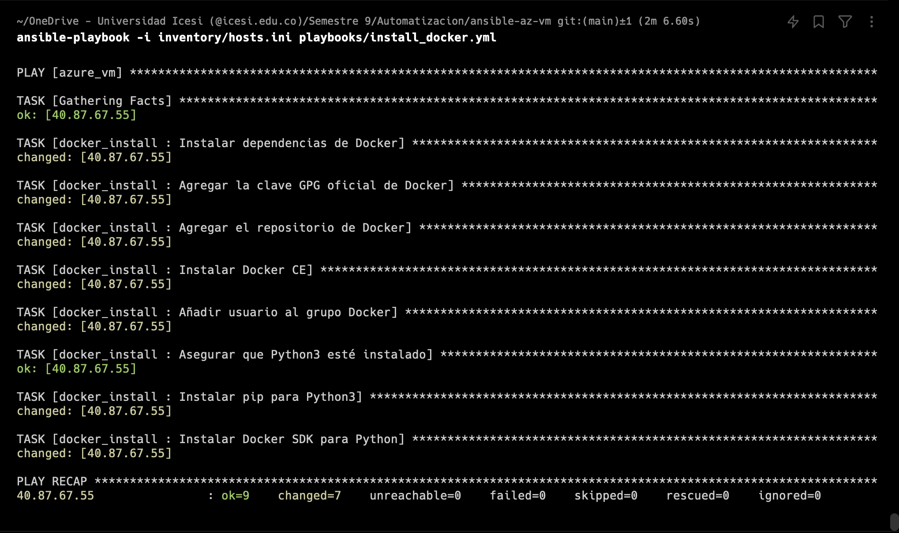
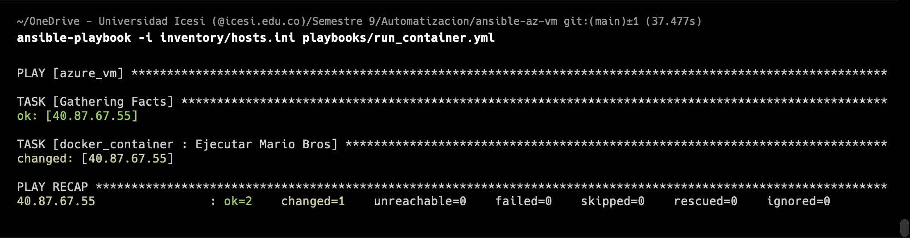
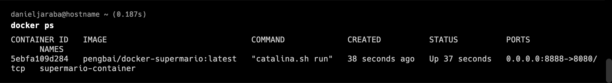

# ansible-az-vm

Daniel Jaraba

---

Ansible project for configuration providing to a Virtual Machine.

---

## Prerrequisites

- Virtual machine running on a Linux distribution.
- Same virtual machine configured with ssh connection using user and password.
- Port configured for HTTP connection in the same virtual machine (8888 for the example case).
- Ansible installed.

---

## How to run

1. Edit the `inventory/hosts.ini` file:

```
[azure_vm]
(VM_PUBLIC_IP) ansible_user=(VM_SSH_USER) ansible_ssh_pass=(VM__SSH_PASSWORD)
```

Change the variables in (MAYUS)

2. Run the Docker install task:

```
ansible-playbook -i inventory/hosts.ini playbooks/install_docker.yml
```



3. Run the Docker container task:

```
ansible-playbook -i inventory/hosts.ini playbooks/run_container.yml
```



---

## Proofs




